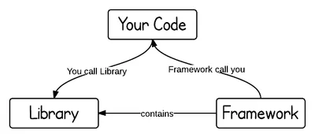

# 库 VS 框架
> [Library vs. Framework?原文链接](https://www.programcreek.com/2011/09/what-is-the-difference-between-a-java-library-and-a-framework/)  

Java库和框架之间的区别是什么？这是两个对开发者来说很重要而又常被混淆的两个概念。    
## 1.库和框架的定义和主要区别
库和框架之间的主要区别是“控制反转”。当你调用一个库中的方法时，你是控制者。但是在框架中，控制反转过来了：是框架调用了你。  
    
一个库仅仅是类定义的集合。库出现的原因仅仅是代码的重复使用，换句话说就是使用别的开发者写好的代码。类和方法通常定义了某个领域中具体地方的具体操作。举个例子来说，一些数学类库可以让开发者不需要实现算法，而只是调用函数来实现功能。  

在框架中，所有的控制流程已经被写了，留下的是一个个预先定义好的了的空白代码块，来让你填充自己的代码。框架通常来说更加复杂，它定义的是骨架，让应用程序定义自己的功能去填充这个骨架。通过这种方式，你的代码会在合适的时候被框架调用。好处就是让开发者的关注点不在于设计的好坏而是在领域内的功能的具体实现。  

## 2.库和框架的联系
两者都定义供程序员调用的了API。我门可以将库设想成一些实现了的功能，把框架设想成一个应用的骨架，而API是两者的连接器。一个典型的开发过程通常先使用一个框架，然后用库中定义的的功能填充框架，填充的过程使用API的方式。

## 3.范例
- [如何制作一个Java库](https://www.programcreek.com/2011/07/build-a-java-library-for-yourself/)  
- [如何设计一个框架](https://www.programcreek.com/2011/09/how-to-design-a-java-framework/)
